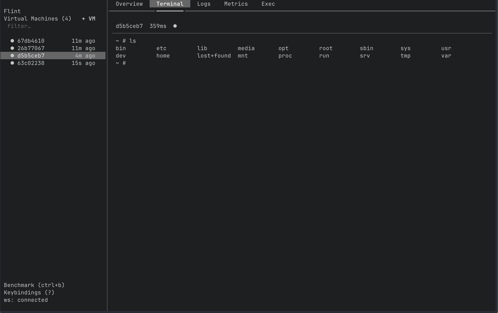

<p align="center">
  <h1 align="center">Flint</h1>
  <p align="center">A cross-platform microVM runtime for Linux and macOS — one Python SDK, CLI, and REST API across every hypervisor</p>
</p>

<p align="center">
  <a href="#-quick-start">Quick Start</a> •
  <a href="#-python-sdk">SDK</a> •
  <a href="#-agents">Agents</a> •
  <a href="#-templates">Templates</a> •
  <a href="#-tui">TUI</a> •
  <a href="#-cli">CLI</a> •
  <a href="#-rest-api">REST API</a> •
  <a href="#-benchmarks">Benchmarks</a> •
  <a href="#-configuration">Configuration</a> •
  <a href="#-macos-apple-silicon">macOS</a> •
  <a href="#-linux-host-setup">Linux Setup</a>
</p>

---

Flint is a microVM runtime that spins up isolated VMs in milliseconds and gives you the same Python SDK, CLI, REST API, and interactive TUI on every platform it supports. The hypervisor underneath — Firecracker, Cloud-Hypervisor, or Apple's Virtualization.framework — is a pluggable backend; the rest of your stack doesn't have to know or care which one is running.

https://github.com/user-attachments/assets/5fdbf10e-7e7a-4688-9414-5bde4d4ed428

## 🚀 Quick Start

### Prerequisites

- **Linux** host with [Firecracker](https://github.com/firecracker-microvm/firecracker) installed, or **macOS** Apple Silicon (Virtualization.framework)
- A rootfs image and vmlinux kernel at `/root/firecracker-vm/` (Linux) — see [Linux Host Setup](#-linux-host-setup)
- Python 3.12+

### Install

```bash
git clone https://github.com/jacquesverre/flint.git
cd flint
uv sync
```

### Run

```bash
# Terminal 1 — start the daemon
uv run flint start

# Terminal 2 — launch the TUI
uv run flint app
```

The daemon creates a golden snapshot on startup, pre-warms a rootfs pool, and listens on `localhost:9100`.

## 🐍 Python SDK

Flint provides an E2B-style `Sandbox` class for programmatic VM management:

```python
from flint import Sandbox

# Create a new sandbox
sandbox = Sandbox()

# Run a command
result = sandbox.commands.run("echo hello")
print(result.stdout)     # "hello"
print(result.exit_code)  # 0

# Properties
sandbox.id            # str
sandbox.state         # str
sandbox.is_running()  # bool

# Pause & resume (state is preserved to disk)
sandbox.pause()
sandbox.resume()

# Auto-cleanup timeout (seconds)
sandbox.set_timeout(300)                   # kill after 5 min
sandbox.set_timeout(300, policy="pause")   # pause instead of kill

# List & connect to existing sandboxes
sandboxes = Sandbox.list()
sandbox = Sandbox.connect(vm_id)

# Clean up
sandbox.kill()
```

> **Note:** The daemon must be running (`flint start`) before using the SDK.

### Code Execution

Execute code with auto-detected runtime (Python or Node.js):

```python
# Python (default)
result = sandbox.run_code("print(2 + 2)")
print(result.stdout)  # "4"

# Node.js
result = sandbox.run_code("console.log('hello')", runtime="node")
print(result.stdout)  # "hello"
```

### Filesystem Operations

Read, write, and list files inside the sandbox:

```python
# Write a file
sandbox.write_file("/workspace/hello.py", "print('hello world')")

# Read it back
content = sandbox.read_file("/workspace/hello.py")
print(content)  # b"print('hello world')"

# List directory contents
files = sandbox.list_files("/workspace")
```

### Interactive PTY

```python
terminal = sandbox.pty.create(
    on_data=lambda data: print(data.decode(), end=''),
)
terminal.send_input("ls -la\n")
terminal.kill()
```

### Network Policy / Credential Injection

Inject HTTP headers into outbound requests based on domain rules. A transparent HTTPS proxy intercepts traffic from the sandbox and adds headers — sandboxes never see raw credentials:

```python
sandbox.update_network_policy({
    "allow": {
        "api.openai.com": [
            {"transform": [{"headers": {"Authorization": "Bearer sk-..."}}]}
        ],
        "*.anthropic.com": [
            {"transform": [{"headers": {"x-api-key": "sk-ant-..."}}]}
        ],
    }
})

# Retrieve current policy
policy = sandbox.get_network_policy()
```

You can also pass `network_policy=` when creating a sandbox via the REST API.

### Boot Timings

```python
# Total boot time
print(sandbox.ready_time_ms)  # e.g. 42

# Per-step breakdown
print(sandbox.timings)
# {'rootfs_copy_ms': 3, 'netns_setup_ms': 5, 'firecracker_popen_ms': 8, ...}
```

## 📦 Templates

Build custom VM templates with a fluent builder API:

```python
from flint import Template, Sandbox

template = (
    Template("python-data-science")
    .from_ubuntu_image("22.04")
    .apt_install("python3", "python3-pip")
    .pip_install("numpy", "pandas")
    .set_workdir("/workspace")
    .build()
)

# Create a sandbox from the template
sandbox = Sandbox(template_id=template.template_id)
```

**Base image methods:**

| Method | Description |
|--------|-------------|
| `.from_ubuntu_image(tag)` | Ubuntu base image |
| `.from_python_image(tag)` | Python base image |
| `.from_node_image(tag)` | Node.js base image |
| `.from_alpine_image(tag)` | Alpine base image |
| `.from_image(image)` | Any Docker image |
| `.from_dockerfile(dockerfile)` | Raw Dockerfile string |

**Operation methods:**

| Method | Description |
|--------|-------------|
| `.apt_install(*packages)` | Install apt packages |
| `.pip_install(*packages)` | Install pip packages |
| `.npm_install(*packages)` | Install npm packages |
| `.run_cmd(cmd)` | Run a shell command |
| `.copy(src, dest)` | Copy files into the image |
| `.set_workdir(path)` | Set the working directory |
| `.set_envs(**envs)` | Set environment variables |
| `.git_clone(repo, dest)` | Clone a git repository |

Call `.build()` to build the template via the daemon. It blocks until the template is ready and returns a `TemplateInfo` with `template_id`, `name`, and `status`.

## 🤖 Agents

Flint ships with pre-packaged AI agents that you can deploy in isolated microVMs with a single command. Agent images are pre-built and published to GitHub Container Registry (GHCR) by CI, so deploys pull a ready-made image instead of building from source. After the first pull, subsequent deploys boot from a cached snapshot in milliseconds.

### Available Agents

| Agent | Description |
|-------|-------------|
| **hermes** | Self-improving AI agent by [Nous Research](https://nousresearch.com) with persistent memory and a learning loop |
| **openclaw** | Autonomous AI agent framework for real-world task execution via messaging platforms |

### Pre-building Agent Templates

Pre-build agent templates so deploys are instant (milliseconds):

```bash
# Pre-build a single agent
flint agents build hermes

# Pre-build all agents
flint agents build --all

# Force rebuild (ignore cache)
flint agents build hermes --force
```

```python
from flint.agents import Agent

Agent.build("hermes")      # build one
Agent.build_all()           # build all
```

### CLI

```bash
# List available agents
flint agents list

# Get details about an agent
flint agents info hermes

# Deploy an agent (builds template on first run, instant after)
flint agents deploy hermes

# Deploy with environment variables
flint agents deploy openclaw -e MODEL_API_KEY=sk-... -e OPENCLAW_PORT=5000

# Deploy without internet access
flint agents deploy hermes --no-internet

# Force rebuild even if cached
flint agents deploy hermes --force-build
```

### Python SDK

```python
from flint.agents import Agent

# List available agents
for defn in Agent.catalog():
    print(f"{defn.name}: {defn.description}")

# Deploy Hermes with API credentials
agent = Agent.deploy("hermes", env={"MODEL_API_KEY": "sk-..."})
print(f"Running in sandbox {agent.sandbox.id}")

# Inject API credentials via network policy (transparent proxy)
agent.set_credentials({
    "api.openai.com": {"Authorization": "Bearer sk-..."},
    "api.anthropic.com": {"x-api-key": "sk-ant-..."},
})

# Run commands inside the agent VM
result = agent.exec("ls /app")
print(result.stdout)

# Check logs
print(agent.logs())

# Pause / resume (snapshot to disk, restore later)
agent.pause()
agent.resume()

# Stop the agent
agent.stop()
```

### Custom Agents

You can register your own agents in the catalog:

```python
from flint.agents.catalog import AgentDefinition, register_agent

register_agent(AgentDefinition(
    name="my-agent",
    description="My custom AI agent",
    repo="https://github.com/me/my-agent.git",
    version="latest",
    license="MIT",
    tags=["custom"],
    dockerfile="""\
FROM python:3.12-slim
RUN pip install my-agent-package
WORKDIR /app
COPY flintd /usr/local/bin/flintd
COPY init-net.sh /etc/init-net.sh
RUN chmod +x /usr/local/bin/flintd /etc/init-net.sh
""",
    post_start_cmd="python -m my_agent &",
))

agent = Agent.deploy("my-agent")
```

## 💻 TUI

A full dashboard for the daemon: VM list + tabbed detail view, live event stream (no polling), a fuzzy command palette, and dedicated screens for Volumes / Templates / Limits / Playground.

<p align="center">
  
</p>

### Home — sidebar + tabbed detail

- **Sidebar**: VM list with status dots, filter input, multi-select (`space`), live updates from the daemon's event stream.
- **Detail tabs** for the selected VM:
  - **Overview** — metadata + boot-timing bar chart
  - **Terminal** — interactive shell (VT100 via pyte)
  - **Logs** — streaming kernel/agent log lines with regex filter + follow toggle
  - **Metrics** — 1 Hz CPU% and RSS sparklines (last 60 samples)
  - **Exec** — command history with re-run

### Screens

| Key | Screen | What it does |
|-----|--------|--------------|
| `Ctrl+P` | Command palette | Fuzzy-match screens + per-VM actions (kill / pause / resume / create) |
| `Ctrl+V` | Volumes | Create / list / delete sparse image volumes |
| `Ctrl+T` | Templates | Built templates + the agents catalog; launch or inspect |
| `Ctrl+L` | Limits | View + edit daemon config overrides (pool size, timeouts, …) |
| `Ctrl+G` | Playground | Spawn an ephemeral VM, run a script, auto-kill on exit |
| `Ctrl+B` | Benchmark | Boot N VMs and chart per-step timings |
| `?` | Keybindings | Auto-generated from the live binding table |

### Home keybindings

| Key | Action |
|-----|--------|
| `+` / click `+ VM` | New VM |
| `Ctrl+Up` / `Ctrl+Down` | Move selection |
| `Space` | Toggle multi-select |
| `Ctrl+D` | Kill the selected VM (or all multi-selected VMs, with a progress toast) |

> **Live state**: the TUI subscribes to `WS /events` and patches its cache on `vm.*` / `volume.*` events — no polling. The footer shows `ws: connected` / `ws: reconnecting…`. On a reconnect, the full list is refetched to re-sync.

## 🖥️ CLI

| Command | Description |
|---------|-------------|
| `flint start` | Start the daemon (`--port`, `--data-dir`, `--state-dir`) |
| `flint app` | Launch the interactive TUI |
| `flint list` | List running VMs |
| `flint stop <vm_id>` | Kill a VM by ID |
| `flint agents list` | List available pre-packaged agents |
| `flint agents info <name>` | Show agent details |
| `flint agents build <name>` | Pre-build an agent template for instant deploys |
| `flint agents build --all` | Pre-build all agent templates |
| `flint agents deploy <name>` | Deploy an agent in a microVM (builds if needed) |
| `flint install-deps` | Install Firecracker, jailer, and vmlinux kernel (Linux) |
| `flint install-deps --check` | Verify installed dependencies |
| `flint setup-macos` | Prepare macOS Virtualization.framework guest assets |
| `flint setup-macos --check` | Verify macOS guest assets |

## 📡 REST API

The daemon exposes a REST API and WebSocket endpoint on `localhost:9100`.

### Sandbox Lifecycle

| Method | Endpoint | Description |
|--------|----------|-------------|
| `POST` | `/vms` | Create a new VM (`template_id`, `allow_internet_access` query params; optional `network_policy` body) |
| `GET` | `/vms` | List all VMs |
| `GET` | `/vms/{vm_id}` | Get VM details |
| `DELETE` | `/vms/{vm_id}` | Kill a VM |
| `POST` | `/vms/{vm_id}/pause` | Pause a VM (snapshot to disk) |
| `POST` | `/vms/{vm_id}/resume` | Resume a paused VM |
| `PATCH` | `/vms/{vm_id}` | Set timeout / timeout policy |

### Command Execution

| Method | Endpoint | Description |
|--------|----------|-------------|
| `POST` | `/vms/{vm_id}/exec` | Execute a command (`{cmd, timeout}`) |

### Filesystem

| Method | Endpoint | Description |
|--------|----------|-------------|
| `GET` | `/vms/{vm_id}/files?path=` | Read a file |
| `POST` | `/vms/{vm_id}/files?path=` | Write a file |
| `DELETE` | `/vms/{vm_id}/files?path=` | Delete a file or directory |
| `GET` | `/vms/{vm_id}/files/stat?path=` | Stat a file |
| `GET` | `/vms/{vm_id}/files/list?path=` | List directory contents |
| `POST` | `/vms/{vm_id}/files/mkdir?path=` | Create a directory |

### Process Management

| Method | Endpoint | Description |
|--------|----------|-------------|
| `POST` | `/vms/{vm_id}/processes` | Start a new process |
| `GET` | `/vms/{vm_id}/processes` | List processes |
| `POST` | `/vms/{vm_id}/processes/{pid}/input` | Send stdin to a process |
| `POST` | `/vms/{vm_id}/processes/{pid}/signal` | Send a signal to a process |
| `POST` | `/vms/{vm_id}/processes/{pid}/resize` | Resize process PTY |

### Network Policy

| Method | Endpoint | Description |
|--------|----------|-------------|
| `PUT` | `/vms/{vm_id}/network-policy` | Update credential injection rules |
| `GET` | `/vms/{vm_id}/network-policy` | Get current network policy |

### Templates

| Method | Endpoint | Description |
|--------|----------|-------------|
| `POST` | `/templates/build` | Build a template from a Dockerfile |
| `GET` | `/templates` | List all templates |
| `GET` | `/templates/{template_id}` | Get template details |
| `DELETE` | `/templates/{template_id}` | Delete a template |

### Volumes

| Method | Endpoint | Description |
|--------|----------|-------------|
| `GET` | `/volumes` | List volumes |
| `POST` | `/volumes` | Create a sparse image volume (`{name, size_gib}`) |
| `DELETE` | `/volumes/{volume_id}` | Delete a volume |

### Metrics / Config

| Method | Endpoint | Description |
|--------|----------|-------------|
| `GET` | `/vms/{vm_id}/metrics?window=N` | Last N (≤60) per-second CPU% / RSS samples |
| `GET` | `/config` | Current config + persisted overrides |
| `PATCH` | `/config` | Save config overrides (applied on next daemon restart) |

### Streams / Health

| Protocol | Endpoint | Description |
|----------|----------|-------------|
| `WS` | `/vms/{vm_id}/terminal` | Interactive terminal (binary WebSocket frames) |
| `WS` | `/vms/{vm_id}/logs` | Kernel + daemon lifecycle log lines for one VM |
| `WS` | `/events` | Daemon-wide event bus: `vm.created`, `vm.deleted`, `vm.state_changed`, `vm.paused`, `vm.resumed`, `volume.created`, `volume.deleted` |
| `GET` | `/health` | Health check + golden snapshot status + backend info |

### Examples

```bash
# Create a VM
curl -X POST localhost:9100/vms

# List VMs
curl localhost:9100/vms

# Execute a command
curl -X POST localhost:9100/vms/<vm_id>/exec \
  -H 'Content-Type: application/json' \
  -d '{"cmd": "echo hello", "timeout": 30}'

# Read a file
curl localhost:9100/vms/<vm_id>/files?path=/etc/hostname

# Pause / resume
curl -X POST localhost:9100/vms/<vm_id>/pause
curl -X POST localhost:9100/vms/<vm_id>/resume

# Set auto-timeout (seconds)
curl -X PATCH localhost:9100/vms/<vm_id> -H 'Content-Type: application/json' \
  -d '{"timeout_seconds": 300, "timeout_policy": "kill"}'

# Kill a VM
curl -X DELETE localhost:9100/vms/<vm_id>
```

## ⚡ Benchmarks

Flint includes a built-in benchmark mode that boots N VMs sequentially, measures time-to-interactive for each, and breaks down per-step timings.

<!-- TODO: replace with actual screenshot -->
<p align="center">
  
</p>

Press `Ctrl+B` in the TUI to run a benchmark. Results include:

- **Per-VM TTI** (time-to-interactive) with min/avg/median/p95/p99/max
- **Per-step breakdown**: rootfs copy, netns setup, Firecracker popen, API ready wait, snapshot load, drive patch, VM resume, TCP connect, first command
- **Throughput**: VMs/second

## ⚙️ Configuration

Flint is configured via environment variables.

### Core

| Variable | Default | Description |
|----------|---------|-------------|
| `FLINT_PORT` | `9100` | Daemon listen port |
| `FLINT_DATA_DIR` | `/var/lib/flint/data` (Linux), `~/Library/Application Support/flint/data` (macOS) | Data directory for VMs |
| `FLINT_STATE_DIR` | `/var/lib/flint/state` (Linux), `~/Library/Application Support/flint/state` (macOS) | State directory for daemon files |

### Storage

| Variable | Default | Description |
|----------|---------|-------------|
| `FLINT_STORAGE_BACKEND` | `local` | Storage backend: `local`, `s3_files`, or `r2` |
| `FLINT_WORKSPACE_DIR` | `/workspace` | Workspace path inside sandboxes |

### S3 Files

| Variable | Default | Description |
|----------|---------|-------------|
| `FLINT_S3_FILES_NFS_ENDPOINT` | — | S3 Files NFS endpoint |

### Cloudflare R2

| Variable | Default | Description |
|----------|---------|-------------|
| `FLINT_R2_ACCOUNT_ID` | — | R2 account ID |
| `FLINT_R2_ACCESS_KEY_ID` | — | R2 access key ID |
| `FLINT_R2_SECRET_ACCESS_KEY` | — | R2 secret access key |
| `FLINT_R2_BUCKET` | `flint-storage` | R2 bucket name |
| `FLINT_R2_CACHE_DIR` | `{STATE_DIR}/r2-cache` | Local cache directory |
| `FLINT_R2_CACHE_SIZE_MB` | `1024` | Local cache size in MB |

### Firecracker / Jailer

| Variable | Default | Description |
|----------|---------|-------------|
| `FLINT_FIRECRACKER_BINARY` | `/usr/local/bin/firecracker` | Path to Firecracker binary |
| `FLINT_JAILER_BINARY` | `jailer` | Path to jailer binary |
| `FLINT_JAILER_BASE_DIR` | `/srv/jailer` | Jailer base directory |
| `FLINT_JAILER_UID` | `1000` | Jailer UID |
| `FLINT_JAILER_GID` | `1000` | Jailer GID |

### macOS Virtualization.framework

| Variable | Default | Description |
|----------|---------|-------------|
| `FLINT_VZ_KERNEL_PATH` | `{DATA_DIR}/vz/vmlinux` | VZ kernel path |
| `FLINT_VZ_ROOTFS_PATH` | `{DATA_DIR}/vz/rootfs.img` | VZ rootfs path |
| `FLINT_VZ_CPU_COUNT` | `2` | vCPUs per VM |
| `FLINT_VZ_MEMORY_BYTES` | `2147483648` (2 GB) | Memory per VM |
| `FLINT_VZ_READY_TIMEOUT` | `60` | Seconds to wait for VM readiness |

## 🍎 macOS Apple Silicon

Flint supports macOS on Apple Silicon via the Virtualization.framework backend.

### Setup

```bash
# Download kernel and build Alpine rootfs for macOS
flint setup-macos

# Verify assets are in place
flint setup-macos --check
```

Options: `--alpine-version`, `--kernel-version`, `--rootfs-size-mb`, `--force`.

Once setup is complete, `flint start` auto-detects the macOS backend and starts the daemon.

## 🔧 Linux Host Setup

Flint expects a Linux host with Firecracker, a kernel, and a rootfs image.

### 1. Install Firecracker, jailer, and kernel

If Flint is already installed:

```bash
sudo flint install-deps
```

Or without Flint installed yet:

```bash
curl -fsSL https://raw.githubusercontent.com/jacquesverre/flint/main/scripts/install-deps.sh | sudo sh
```

To pin a specific version:

```bash
FC_VERSION=v1.10.1 curl -fsSL https://raw.githubusercontent.com/jacquesverre/flint/main/scripts/install-deps.sh | sudo sh
```

To verify what is installed:

```bash
sudo flint install-deps --check
```

### 2. Build the rootfs image

Flint uses an Alpine-based rootfs with the `flintd` guest agent. The `setup-rootfs.sh` script builds it:

```bash
sudo ./setup-rootfs.sh
```

This creates a 200 MB ext4 image at `/root/firecracker-vm/rootfs.ext4`.

### 3. Verify

You should have:

```
/root/firecracker-vm/
├── vmlinux        # Uncompressed Linux kernel
└── rootfs.ext4    # Alpine rootfs with flintd guest agent
```

Once these are in place, `flint start` will create the golden snapshot automatically on first run.

---

Built on [Firecracker](https://firecracker-microvm.github.io/), [Cloud-Hypervisor](https://www.cloudhypervisor.org/), and Apple's [Virtualization.framework](https://developer.apple.com/documentation/virtualization).
