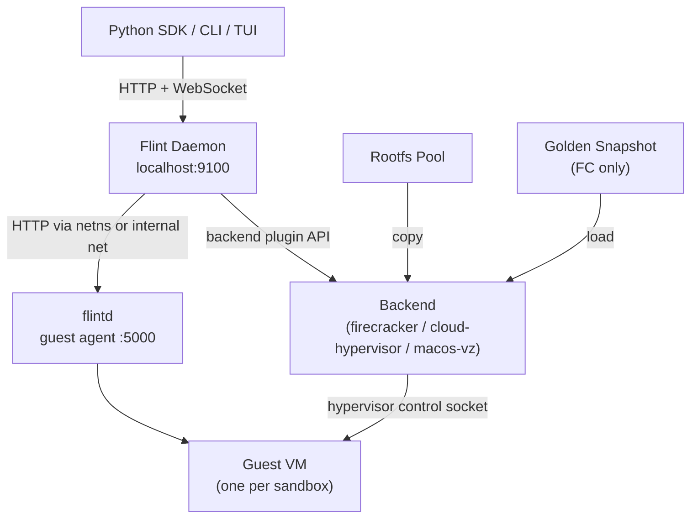

Flint has five main pieces: the daemon, the **backend plugin** that drives the hypervisor, the guest agent, the Python SDK, and the rootfs pool. Here's how they relate.

## The daemon

The daemon is a FastAPI process that owns all VM lifecycle. It runs on `localhost:9100` and:

- Manages the rootfs pool — keeps pre-copied rootfs images ready to go
- Delegates VM boot, pause, resume, and recovery to the configured backend plugin
- Sets up per-VM networking (netns + TAP on Linux, internal network on macOS)
- Proxies SDK calls (exec, file ops, PTY) to the guest agent inside the VM
- Persists sandbox state to SQLite so it can recover after crashes
- Runs background health checks and enforces timeouts

## Backend plugins

Flint's hypervisor support is pluggable. Each backend is a class that implements the `BackendPlugin` contract — boot, pause, resume, kill, reattach-on-recover, preflight, template-artifact validation. Three backends ship in the box:

| Backend | Platform | Boot strategy | Snapshot / restore |
|---------|----------|---------------|--------------------|
| `firecracker` | Linux (KVM) | Load golden snapshot | Yes (full snapshot via API) |
| `cloud-hypervisor` | Linux (KVM) | Fresh boot against prepared rootfs | Yes (pause/restore via API) |
| `macos-vz` | macOS Apple Silicon | Virtualization.framework VM | Not yet |

The daemon picks one at startup based on `--backend` / `FLINT_BACKEND` / host default. Third parties can publish their own plugins via the `flint.backends` entry-point group. See [Backends](/cli/backends) for details.

## The guest agent (flintd)

Inside each VM, a small Go HTTP server called `flintd` runs on port `5000`. It handles:

- Synchronous command execution (`POST /exec`)
- Long-running process management with PTY support
- File operations (read, write, list, stat, mkdir, delete)
- WebSocket output streaming

The daemon reaches `flintd` over the VM's private network — on Linux by entering the VM's netns and requesting the guest IP (`172.16.0.2`), on macOS over the VZ internal network.

See the [guest agent](/architecture/guest-agent) page for more.

## The rootfs pool

Copying a rootfs image for each new sandbox takes a few hundred milliseconds on its own. To avoid this, the daemon maintains a pool of pre-copied rootfs images. When you create a sandbox, it just claims one from the pool and starts immediately.

See the [golden snapshots](/architecture/golden-snapshots) page for more on how this and the snapshot system work (Firecracker-specific).

## Networking

Each Linux sandbox gets its own network namespace with a TAP device. Traffic from the VM goes through a bridge (`br-flint`) on the host, which has internet access via NAT. macOS uses the Virtualization.framework's internal network instead.

See the [networking](/architecture/networking) page for the full picture.
