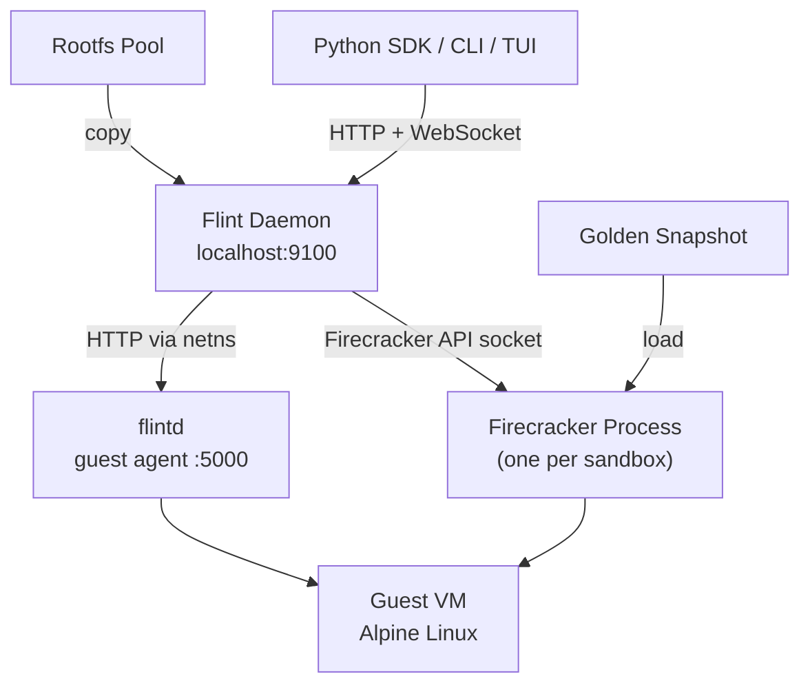

Flint has four main pieces: the daemon, the guest agent, the Python SDK, and the rootfs pool. Here's how they relate.

## The daemon

The daemon is a FastAPI process that owns all VM lifecycle. It runs on `localhost:9100` and:

- Manages the rootfs pool - keeps pre-copied rootfs images ready to go
- Boots VMs by loading the golden snapshot into a new Firecracker process
- Sets up a network namespace and TAP device for each VM
- Proxies SDK calls (exec, file ops, PTY) to the guest agent inside the VM
- Persists sandbox state to SQLite so it can recover after crashes
- Runs background health checks and enforces timeouts

## Firecracker

Each sandbox is a Firecracker microVM - a real VM with CPU-level isolation, not a container. The daemon communicates with each Firecracker process over a Unix socket at `/microvms/{vm_id}/firecracker.sock`.

When you create a sandbox, the daemon doesn't boot a new VM from scratch. Instead it loads the [golden snapshot](/architecture/golden-snapshots) - a pre-booted VM image - which is why startup is so fast.

## The guest agent (flintd)

Inside each VM, a small Go HTTP server called `flintd` runs on port `5000`. It handles:

- Synchronous command execution (`POST /exec`)
- Long-running process management with PTY support
- File operations (read, write, list, stat, mkdir, delete)
- WebSocket output streaming

The daemon reaches `flintd` by entering the VM's network namespace and making HTTP requests to the guest IP (`172.16.0.2`).

See the [guest agent](/architecture/guest-agent) page for more.

## The rootfs pool

Copying a rootfs image for each new sandbox takes a few hundred milliseconds on its own. To avoid this, the daemon maintains a pool of pre-copied rootfs images (`/microvms/.pool/`). When you create a sandbox, it just claims one from the pool and starts immediately.

See the [golden snapshots](/architecture/golden-snapshots) page for more on how this and the snapshot system work.

## Networking

Each sandbox gets its own network namespace with a TAP device. Traffic from the VM goes through a bridge (`br-flint`) on the host, which has internet access via NAT.

See the [networking](/architecture/networking) page for the full picture.
